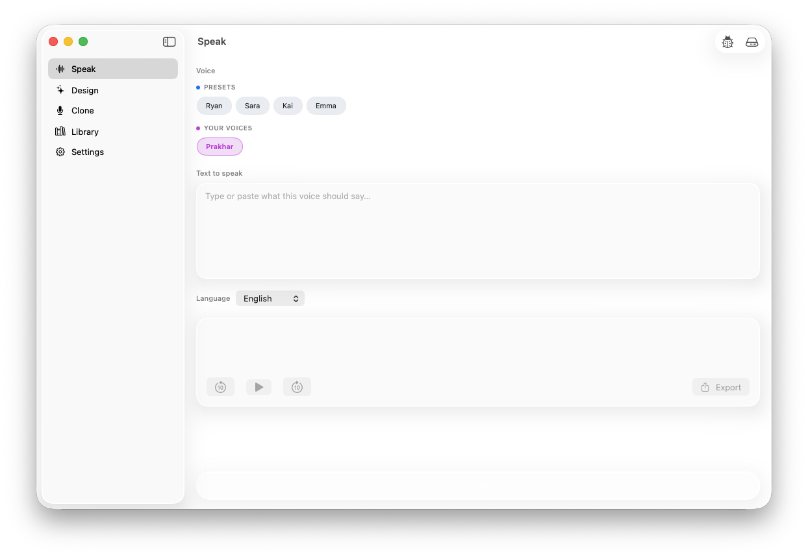
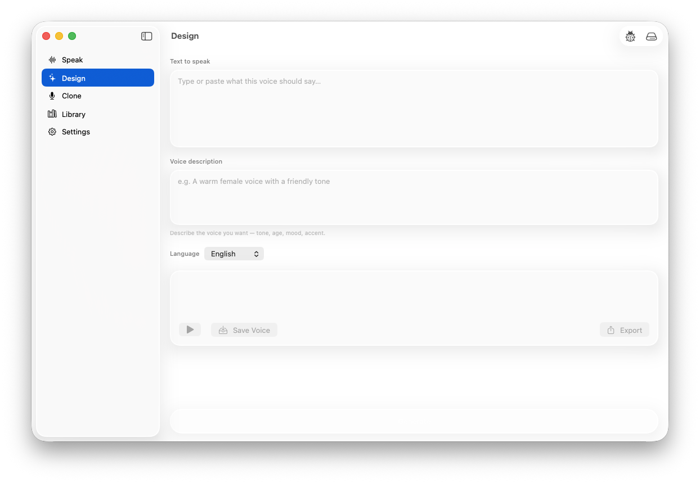
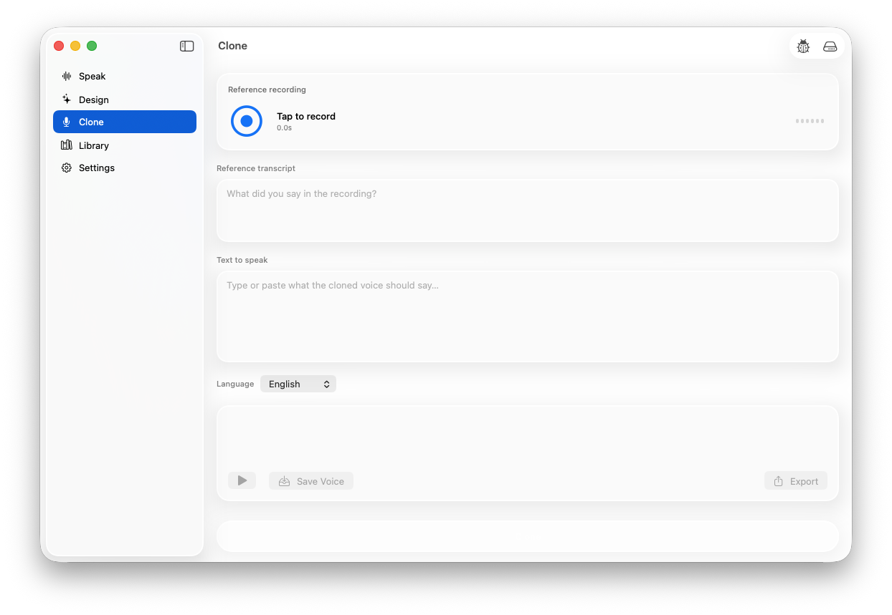
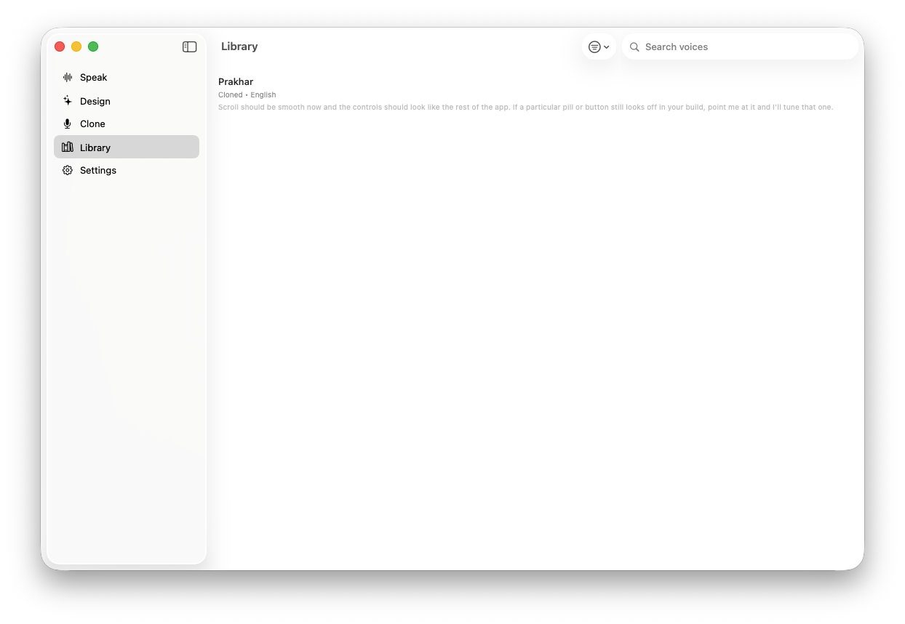

# PolyJuiceVoice

On-device text-to-speech for macOS (and iOS) with voice cloning and voice design,
powered by Apple's [MLX](https://github.com/ml-explore/mlx-swift) and the
[Qwen3-TTS](https://huggingface.co/Qwen/Qwen3-TTS-0.6B) family of models. Everything
runs locally over Metal — no audio, transcripts, or recordings ever leave the device.

> **Platforms:** macOS 26+ (primary), iOS 26+ (secondary).
> **Hardware:** Apple silicon required. The iOS Simulator is not supported — MLX
> needs a real Metal device.

---

## The four modes

The app is organized around four working modes plus a Settings tab. Each mode
maps to a distinct task and uses the model best suited for it.

### Speak



Type a prompt, pick a voice, hit **Speak** (⌘↩). Voices are split into two
sections: **Presets** (the stock speakers shipped with Qwen3-TTS) and **Your
Voices** (anything you've cloned or designed and saved to the library). The
playback card gives you scrub controls, a waveform, and an Export / Share button
for the rendered audio.

For preset voices a **Style instruction** field appears — a short natural-language
hint like *"calm and warm"* or *"excited, fast pace"* that the model uses to color
the delivery. Cloned and designed voices ignore the field; their character is
already baked into the saved voice.

### Design



Build a brand-new voice from a written description — *"a warm female voice with a
friendly tone,"* *"gravelly older man, slow cadence,"* etc. The model generates a
sample reading the text you provided, you can iterate on the description until it
sounds right, and **Save Voice** drops it into your library so it shows up under
**Your Voices** in the Speak tab.

This is the right mode when you don't have a reference recording but you do know
what the voice should *feel* like.

### Clone



Capture a short reference recording (⌘R to start/stop), type the **reference
transcript** so the model knows what was actually said, then type whatever you
want the cloned voice to say next. **Clone** (⌘↩) renders new audio in the same
voice. Save it to the library and it becomes a regular pickable voice in the
Speak tab.

A few seconds of clean speech is enough — longer is fine but not required. The
reference transcript field is multi-line because clean cloning works best when
the transcript matches the recording word-for-word.

### Library



Everything you've cloned or designed lives here. Search by name, filter by type
(cloned vs. designed), rename, delete. Selecting a voice in the Library is just
a shortcut for "use this in Speak" — there's no separate playback surface, since
all generation flows go through the Speak tab.

---

## Settings

Not a "mode" but worth a mention: **Settings** is where you manage downloaded
models (the Qwen3-TTS variants — both 0.6B and 1.7B families across multiple
precisions from 4-bit through bf16), grant microphone access for Clone, view the
debug log, and check disk usage. The first time you launch the app a thin "set
up models" prompt points you at the Model Manager.

---

## Building from source

Requires Xcode 17+ on Apple silicon.

```bash
# macOS (primary target — runs directly on your Mac)
xcodebuild build \
  -project PolyJuiceVoice.xcodeproj \
  -scheme PolyJuiceVoice \
  -destination 'platform=macOS,arch=arm64'

# Physical iOS device (no Simulator support — MLX needs Metal hardware)
xcodebuild build \
  -project PolyJuiceVoice.xcodeproj \
  -scheme PolyJuiceVoice \
  -destination 'generic/platform=iOS'
```

For dev-time model loading without redownloading, set
`POLYJUICEVOICE_MODELS_DIR` in your scheme's environment variables to a folder
containing the unpacked `Qwen3TTS_*` subdirectories. See
[`docs/BUILD_AND_RUN.md`](docs/BUILD_AND_RUN.md) and [`CLAUDE.md`](CLAUDE.md) for
the full setup.

## License

[MIT](LICENSE).
